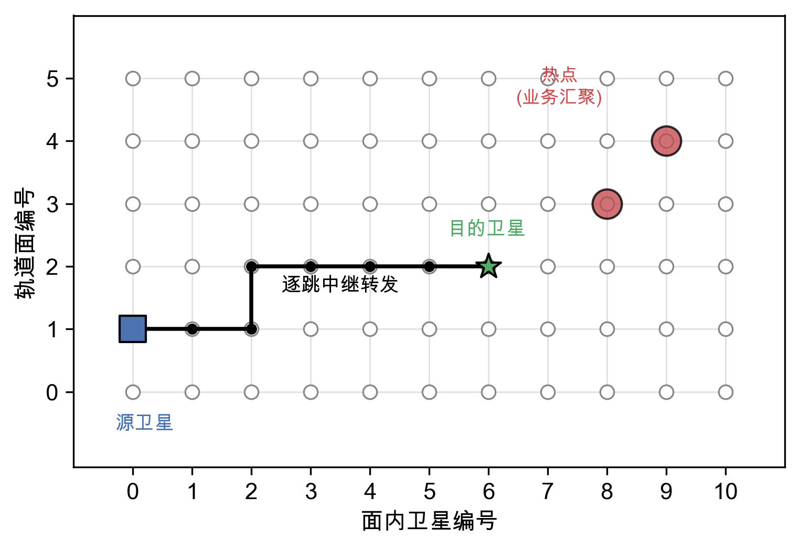
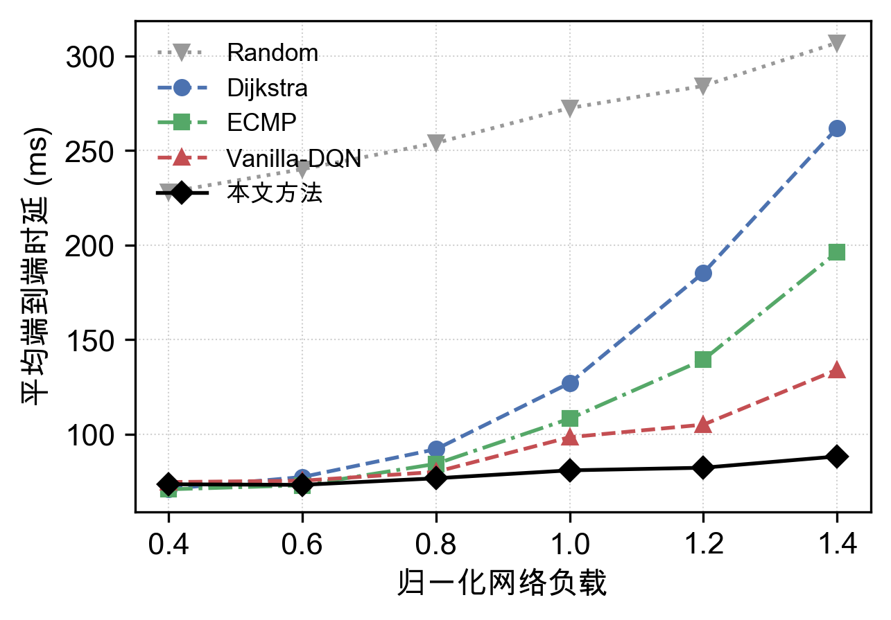
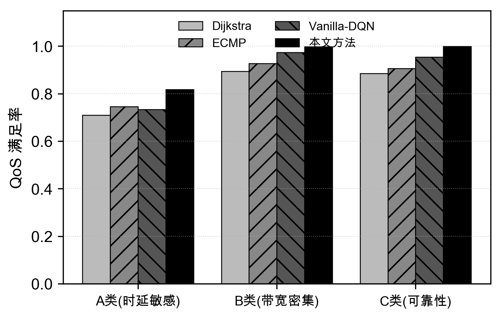

# CA-MQR：低轨卫星网络拥塞感知的多业务智能路由方法

本仓库为论文 **《低轨卫星网络拥塞感知的多业务智能路由方法》** 的完整开源实现，包含仿真平台、算法代码、实验结果、论文原文与全部插图。方法命名为 **CA-MQR**（Congestion-Aware Multi-service QoS Routing）。

代码基于 **纯 Python** 实现（不依赖 NS-3 / OMNeT++ / STK 等重型仿真器），普通笔记本即可复现全部实验。

---

## 1. 研究简介

低轨（LEO）卫星网络在高负载下，传统最短路径（Dijkstra）会把大量业务流汇聚到同一批最短路径上，造成"热点拥塞"、排队时延暴涨；且不同业务（时延敏感 / 带宽密集 / 可靠性优先）的 QoS 需求差异显著，单一最短路径难以差异化保障。

本文以 **拥塞感知** 为主线，提出 CA-MQR：

| 层次 | 设计 | 作用 |
|------|------|------|
| 主干 | 拥塞感知的多业务 POMDP 建模 | 状态引入链路实时利用率 + 业务类型，奖励按三类业务差异化 |
| 增强 | 下游拥塞势场 | 通过邻居间局部迭代感知"下游拥塞纵深"，提前规避拥塞区域 |
| 求解 | 竞争式双深度 Q 网络（Dueling Double DQN） | 解耦状态价值与动作优势，提升训练稳定性 |

**核心结果**：在归一化负载 1.4 的重载场景下，CA-MQR 平均端到端时延相比 Dijkstra 降低约 **66%**，三类业务 QoS 满足率均优于所有基线。

---

## 2. 仿真场景

- **网络节点**：66 颗卫星（Walker Delta 66/6/1 星座：6 轨道面 × 11 星/面，550 km，倾角 53°，相位因子 F=1），采用 +Grid 星间链路拓扑（每星 4 个邻居：前/后/左/右）。
- **业务流**：每条业务流抽象为三元组 `(源卫星, 目的卫星, 业务类别)`；每颗卫星既是接入节点也是转发节点。
- **转发方式**：逐跳转发，智能体在每一跳从 4 个 +Grid 邻居中选择下一跳，直至到达目的卫星。
- **拥塞传导**：多条业务流依次注入，每条流占用其路径链路带宽，后续流感知到已有拥塞。通过调节流数量得到从轻载到重载的负载梯度。

三类业务及其 QoS 需求：

| 业务类型 | 典型应用 | 速率 | 时延约束 | 带宽约束 | 丢包约束 | 占比 |
|---------|---------|------|---------|---------|---------|------|
| A 类（时延敏感） | 应急通信 | 2 Mbps | ≤120 ms | ≥1 Mbps | ≤1e-2 | 30% |
| B 类（带宽密集） | 遥感回传 | 8 Mbps | ≤300 ms | ≥4 Mbps | ≤5e-2 | 50% |
| C 类（可靠性优先） | 工业控制 | 1.5 Mbps | ≤300 ms | ≥0.5 Mbps | ≤1e-4 | 20% |



---

## 3. 仓库结构

```
CA-MQR/
├── README.md                  本文件
├── requirements.txt           Python 依赖
├── src/                       源代码
│   ├── constellation.py       Walker Delta 星座建模（开普勒轨道 + +Grid 拓扑）
│   ├── network.py             链路拥塞模型 + 逐跳路由 POMDP + 下游拥塞势场
│   ├── train.py               Dueling Double DQN + 4 种基线 + 训练/评估主程序
│   └── plot.py                根据结果生成全部论文插图
├── results/
│   └── results.json           完整实验结果数据（训练曲线 / 负载扫描 / 消融 / 势场）
├── figures/                   全部论文插图（9 张，PNG）
├── paper/                     论文原文
│   ├── *.docx / *.pdf         论文成稿
│   ├── paper_source.md        论文 Markdown 源
│   └── build_docx.py          由 Markdown 生成论文 docx 的脚本
└── docs/
    └── EXPERIMENTS.md         实验详解与结果说明
```

---

## 4. 使用环境

- Python ≥ 3.9
- 依赖：`torch>=2.0`、`numpy`、`networkx`、`matplotlib`（见 `requirements.txt`）
- 无需 GPU，CPU 即可（本文小规模模型在 CPU 上比 GPU 更快，代码默认使用 CPU）

安装依赖：

```bash
pip install -r requirements.txt
```

---

## 5. 操作步骤

所有命令均在 `src/` 目录下执行。

### 5.1 快速复现插图（使用已有结果）

仓库已提供完整实验结果 `results/results.json`，可直接据此重绘全部插图：

```bash
cd src
python plot.py
```

生成的 9 张图输出到 `figures/`。

### 5.2 从零运行完整实验

重新训练模型并生成结果（CPU 上约需 10–15 分钟）：

```bash
cd src
python train.py      # 训练 CA-MQR 与各基线, 输出 ../results/results.json
python plot.py       # 根据新结果绘图
```

`train.py` 会依次完成：

1. 训练 CA-MQR（拥塞感知 + 业务差异化 + Dueling）与 Vanilla-DQN（拥塞无感知基线）；
2. 负载扫描评估（对比 Random / Dijkstra / ECMP / Vanilla-DQN / CA-MQR）；
3. 分业务 QoS 评估；
4. 竞争式网络结构的消融实验（多随机种子）；
5. 下游拥塞势场增强实验（热点汇聚场景）。

### 5.3 单独调用各模块（可选）

```python
from constellation import Constellation
from network import SatNetwork, RoutingMDP

con = Constellation()                 # 66 星 Walker Delta 星座
net = SatNetwork(con, load_factor=1.0)  # 带拥塞的网络快照
```

---

## 6. 对比方法与评价指标

**对比方法（5 个，性能从弱到强）**：

| 方法 | 说明 |
|------|------|
| Random | 随机选下一跳，性能下界 |
| Dijkstra | 时延最短路，不感知拥塞 |
| ECMP | 等价多路径，具备一定负载均衡能力 |
| Vanilla-DQN | 普通 DQN，状态不含利用率、奖励仅按静态时延（拥塞感知消融版） |
| **CA-MQR（本文）** | 拥塞感知 + 业务差异化 + 下游势场 + Dueling |

**评价指标**：平均端到端时延、链路利用率（95 分位）、三类业务 QoS 满足率、P95 尾部时延、训练收敛曲线。

---

## 7. 主要结果

| 指标（归一化负载 1.4） | Dijkstra | ECMP | Vanilla-DQN | CA-MQR |
|----------------------|---------|------|-------------|--------|
| 平均端到端时延 (ms) | 262 | 196 | 134 | **88** |
| 链路利用率 (95 分位) | 0.99 | 0.92 | 0.84 | **0.71** |

- **时延**：CA-MQR 相比 Dijkstra 降低约 66%，且随负载增长增幅最小。
- **QoS**：三类业务满足率均为最优（A 类 0.82、B 类 1.00、C 类 1.00）。
- **消融**：去除拥塞感知与业务差异化后（Vanilla-DQN），重载时延由 88 ms 升至 134 ms，证明其为性能主要来源；竞争式网络结构主要提升训练稳定性。
- **势场增强**：在流量热点汇聚的严重拥塞场景下，下游拥塞势场进一步将 P95 尾部时延降低约 32%。

部分结果图示：

| 端到端时延 vs 负载 | 三类业务 QoS 满足率 |
|:---:|:---:|
|  |  |

更详细的实验说明见 [`docs/EXPERIMENTS.md`](docs/EXPERIMENTS.md)。

---

## 8. 引用

如本仓库对你的研究有帮助，请引用本论文（见 `paper/` 目录）：

```
姚飞. 低轨卫星网络拥塞感知的多业务智能路由方法. 第 41 届南京地区研究生通信年会.
```
